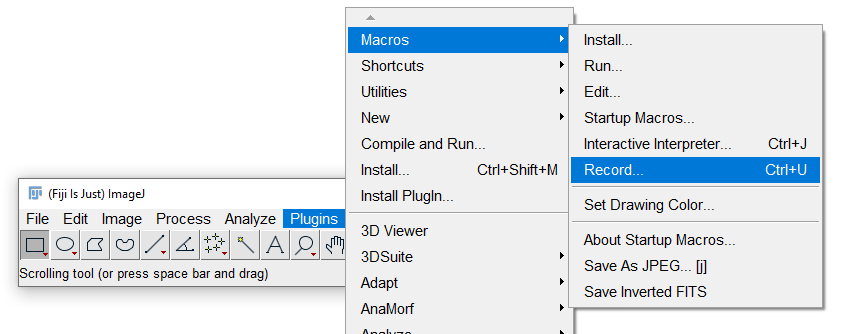

# Overview

This tutorial demonstrates how to
1. Use [the macro recorder](../scripting/macro.md#the-recorder) to record a series of commands to form the basis of a macro
2. Edit the output from the macro recorder so that it can be run on any open image
3. Enclose the code from step 2 inside a loop so that it runs on multiple images
4. Add a dialog so that a user can modify the parameters to the macro prior to execution

# 1. Record Commands with the Macro Recorder

## 1.1 Start the macro recorder

To start the macro recorder, go to `Plugins > Macros > Record`:

Every command you now access through ImageJ's menu will be recorded as a line of text in the macro recorder.

> [!IMPORTANT]
> Some commands will not be recorded, or not recorded correctly, but the vast majority of the functionality in ImageJ/FIJI's menus is macro-recordable.

## 1.2 Perform a simple workflow

Perform a series of commands that you would like to automate with a macro. The commands recorded below resulted from:
1. The opening of an image with [BioFormats](https://www.openmicroscopy.org/bio-formats/)
2. Selecting the first channel and applying a Gaussian blur
3. Thresholding the image with the default method
4. Generating a particle count using the `summarize` option in the [Analyze Particles](https://imagej.net/ij/docs/guide/146-30.html#sub:Analyze-Particles...) tool.

# 2. Edit the Output from the Macro Recorder

It's possible to edit commands directly within the Macro Recorder, but it's probably easier to use the [Script Editor](https://imagej.net/scripting/script-editor). You can launch the Script Editor directly from the Macro Recorder by clicking the `Create` button.

# 3. Create a Loop to Run on Multiple Images

# 4. Create a Dialog to Obtain User Input
